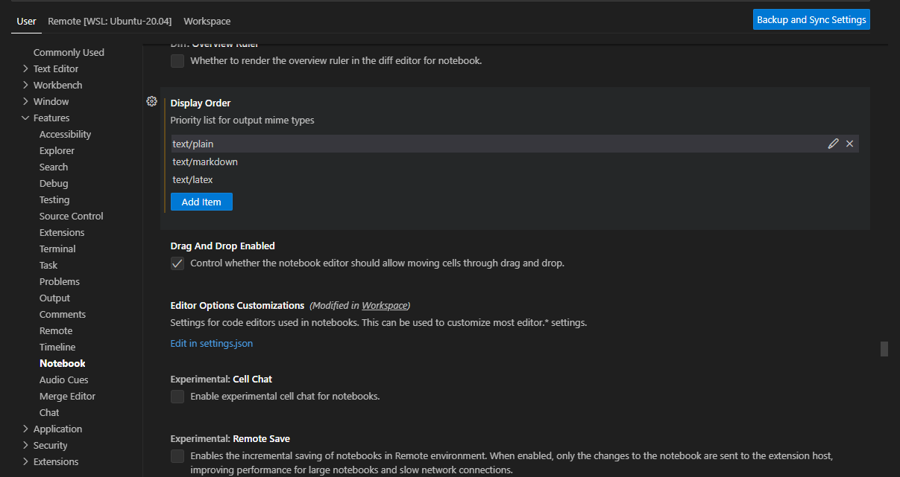

# mml-book-julia

This is a Julia version of the book [Mathematics for Machine Learning](https://mml-book.github.io/). 

## Pre-requisites

Who already familiar with python.

Cell presentation
please select `text/plain` or `text/markdown`.

Or change it default from settings.



## Julia

* Using version 1.94

https://julia.quantecon.org/getting_started_julia/getting_started.html


*  MacOS

   ```
   brew install julia
   ```

* Linux

   ```
   wget https://julialang-s3.julialang.org/bin/linux/x64/1.9/julia-1.9.4-linux-x86_64.tar.gz
   tar zxvf julia-1.9.4-linux-x86_64.tar.gz
   export PATH="$PATH:/path/to/<Julia directory>/bin"
   ```


In the terminal type `julia` to open the julia prompt

```
   _       _ _(_)_     |  Documentation: https://docs.julialang.org
  (_)     | (_) (_)    |
   _ _   _| |_  __ _   |  Type "?" for help, "]?" for Pkg help.
  | | | | | | |/ _` |  |
  | | |_| | | | (_| |  |  Version 1.9.4 (2023-11-14)
 _/ |\__'_|_|_|\__'_|  |  Built by Homebrew (v1.9.4)
|__/                   |

```

* able the jupyter in VSCode, install `ipykernel` in your python environment.

```julia
using Pkg
Pkg.add("IJulia")
# Pkg.rm("IJulia")
```

https://github.com/microsoft/vscode-jupyter/issues/13493
